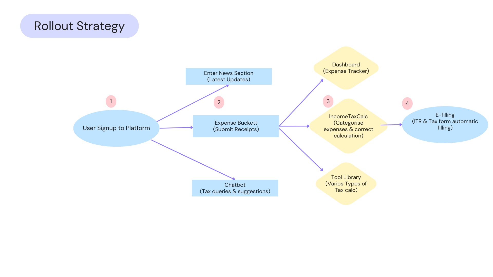
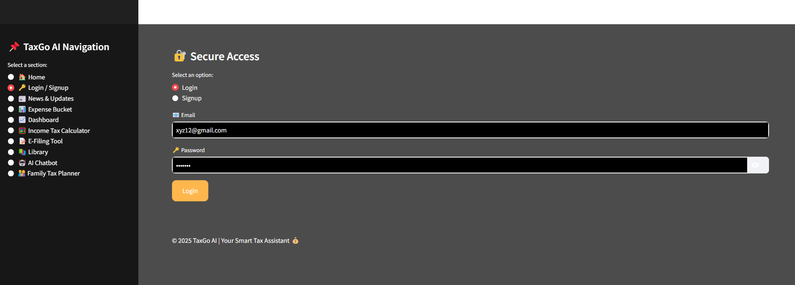
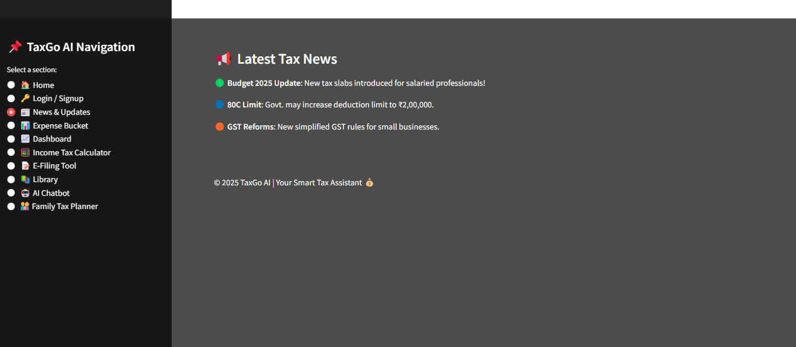
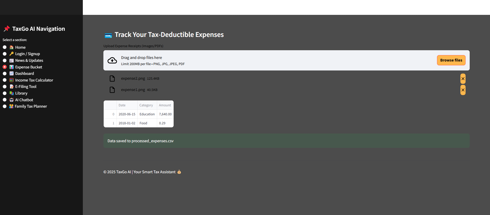
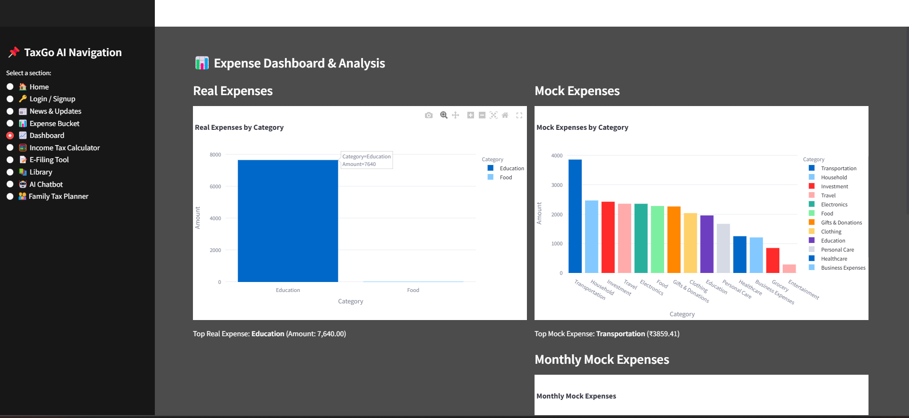
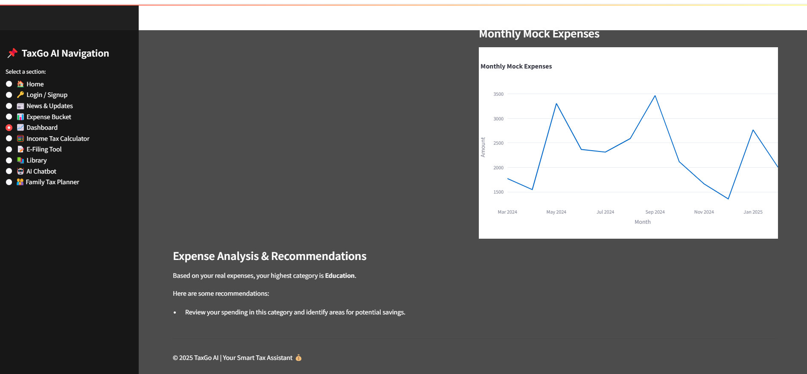
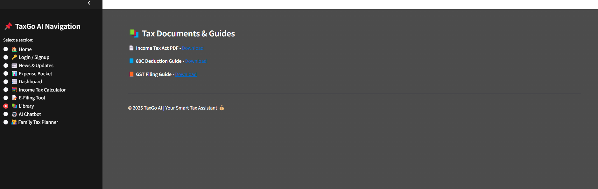
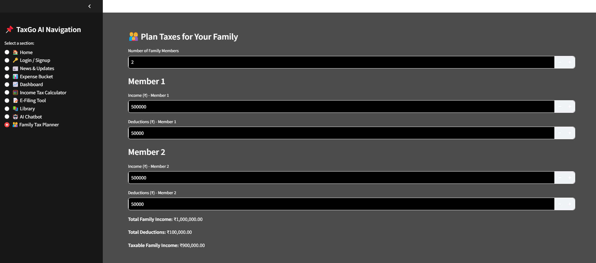

# TaxGo Platform

## Introduction

### Problem:
Filing taxes manually is complicated. People often make mistakes in calculations, miss out on deductions, and are unaware of tax-saving policies. Hiring a CA for personal tax filing can be expensive, and many lack proper financial guidance.

### Solution:
Our AI-powered Tax Assistant simplifies the tax filing process by:
- ✅ Categorizing expenses from receipts to identify tax-deductible items.
- ✅ Automatically calculating taxable income and applicable deductions.
- ✅ Suggesting investment plans based on income to maximize savings.
- ✅ Providing a financial dashboard to track expenses, investments, and tax benefits.
- ✅ Auto-filling tax forms to minimize errors and streamline filing.

## Features

1️⃣ **Tax News Section** 📰 – Stay updated with the latest tax policies, deductions, and government announcements, ensuring users make informed financial decisions.

2️⃣ **Expense Bucket** 📂 – Users can upload expense receipts, Form 16, and bank statements. The AI will categorize expenses, identify deductions, and highlight tax-saving opportunities.

3️⃣ **Smart Dashboard** 📊 – A personalized financial tracker that displays income, categorized expenses, tax liabilities, and investment growth, helping users maintain financial health.

4️⃣ **AI-Powered Tax Calculator** 📑 – Automatically analyzes expenses, applies relevant deductions, and calculates accurate tax liabilities based on Indian tax laws.

5️⃣ **E-Filing Assistant** ✅ – Fills out tax forms automatically, reducing manual errors and making tax filing quick and hassle-free. Users simply review and submit.

6️⃣ **Tax Tool Library** 🛠️ – A collection of tools including HRA calculators, income tax calculators, investment planners, and family tax planners to help users strategize and optimize tax savings.

7️⃣ **AI Chatbot** 🤖 – Instantly answers tax-related queries, explains deductions, and guides users through tax filing in a simplified manner.

## Workflow:




## Features Demo:

### **🔹 Login Page**


### **🔹 News Section**


### **🔹 Expense Bucket**


### **🔹 Dashboard**



### **🔹 Income Tax Calculator**


### **🔹 Library**


### **🔹 Family Planner**


## Step-by-Step Algorithm for AI-Based Tax Calculation
### Step 1: Upload Receipts & Extract Data
- User uploads expense receipts (PDFs, Images, etc.).
- Convert receipts into text or CSV format for processing.
### Step 2: Convert to Structured CSV
- Extracted data (expenses, amounts, dates, etc.) is structured into a CSV.
- Use regex & NLP to identify expense type (Medical, Rent, Education, etc.).
### Step 3: Process Tax Law PDF & Extract Deduction Rules
- AI extracts tax deduction categories from an Indian Tax Law PDF.
- Categorizes laws into Medical, Housing, Education, Investments, etc.
- Identifies deductible vs. non-deductible expenses.
-  Using  PyMuPDF / LangChain (LLM) for tax law PDF processing.
### Step 4: Match Expenses with Deduction Rules
- Compare user's expense CSV with extracted tax deduction rules.
- Identify valid deductions and non-deductible expenses.
  
## Installation

### Prerequisites

- Python 3.8+a

### Environment Setup

1. Clone the repository:
```bash
git clone https://github.com/Muskan655/TaxGo
```
2. Install dependencies:
```bash
pip install -r requirements.txt
```
3. Set up API keys:
```bash
# Create a .env file with your API keys
touch .env
# Add the following lines to the .env file:
 OPEN_API_KEY=your_open_api_key
```
4. Run:
```bash
   streamlit run app.py
```


## Credits

- Developed by Muskan
